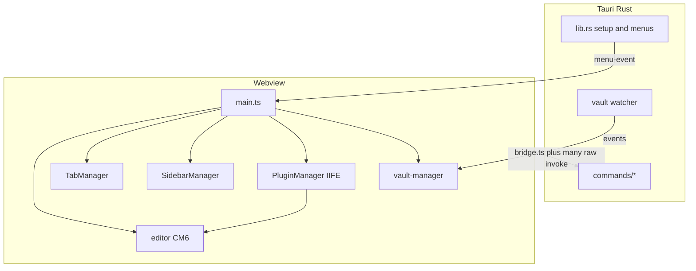

# Architecture (implemented)

Vanilla TypeScript + Vite + CodeMirror 6 in a Tauri 2 webview. Rust owns file I/O, vault index, watchers, settings files, native menus, and dialogs. There is no React/Vue/Svelte layer.

## Core modules

| Area | Path | Notes |
|---|---|---|
| Bootstrap | `src/main.ts` (~1895 lines) | Settings, themes, menus, vault, plugins, tabs, layouts, globals |
| Bridge (intended) | `src/lib/bridge.ts` | Typed `FileResult<T>` wrappers. **Not exclusive** |
| Editor | `src/editor/` | Live preview, format, lists, find, quick capture |
| Tabs | `src/tabs/tab-manager.ts` (~1736 lines) | One `EditorView` for app lifetime; `setState()` on switch |
| Sidebar | `src/sidebar/sidebar-manager.ts` (~1624 lines) | Left/right stacked panels |
| Settings | `src/lib/settings.ts` | In-memory singleton + Rust `settings.json` |
| Vault | `src/lib/vault-manager.ts` + `src-tauri/src/commands/vault.rs` (~2500 lines) | Index, search, tags, watcher |
| Plugins | `src/plugins/index.ts`, `markable-plugin-api.ts`, `user-plugin-loader.ts` | Disk IIFE + `new Function` |
| Native shell | `src-tauri/src/lib.rs`, `menu.rs` | Overlay title bar, hide-on-close, window 50%×80% |

## Plugin pipeline

1. TypeScript sources in `src/plugins/**/*.plugin.ts`
2. `scripts/build-plugins.mjs` emits IIFE files to `src-tauri/plugins/core/`
3. `copy_core_plugins` copies them into Application Support
4. `evaluatePlugin()` runs `new Function(...)` and reads `__markablePlugin__`
5. CM6 packages are window globals (`src/lib/cm-globals.ts`) so StateField slot IDs match the host editor

**Build list (20):** focus-mode, typewriter-mode, word-count, auto-toc, markdown-toolbar, backlinks, templates, yaml-pane, math, media-preview, command-bar, diagrams, insert-count, auto-save, daily-note, file-browser, knowledge-graph, outline-panel, auto-title, typing-assist.

**Not in the IIFE list:** `status-bar` is imported directly from `main.ts`. `vite.plugins.config.ts` is a stale reference list (14 plugins) and does not drive the build.

Largest plugin entries (line counts are approximate): `command-bar.plugin.ts` ~4975, `file-browser.plugin.ts` ~4917, `markdown-toolbar.plugin.ts` ~4432.

## Coupling that blocks a clean core/app split

- `window.__MARKABLE_*` and `__CM_*` globals across host and plugins
- Plugins and some `src/lib` modules call `__TAURI_INTERNALS__.invoke` or `invoke()` instead of `bridge.ts`
- Plugin API comments claim `invoke` is not accessible; runtime practice contradicts that
- Settings, vault list, recent files, plugin enable map, and session tabs share one `com.markable.app` settings file
- Help exists in both `src/help/` and `src-tauri/help/` (Rust `include_str!`)

## Spec status (docs only)

`docs/specs/` contains 62 feature indexes. Most still say `status: active` even though the code shipped. Marked `reference` (do not treat as exclusive): yaml-pane, wiki-link-hover-preview, tab-context-menu, smart-folders, sidebar, media-preview-v2, image-metadata, folder-view, folder-view-layout-refactor, export, backlinks, advanced-lists.

Durable operator docs to keep:

- `docs/specs/invariants/window-size-defaults.md`
- `docs/specs/user-plugins/authoring-guide.md`
- `docs/specs/folder-view/reference.md`
- `docs/build-notes/`
